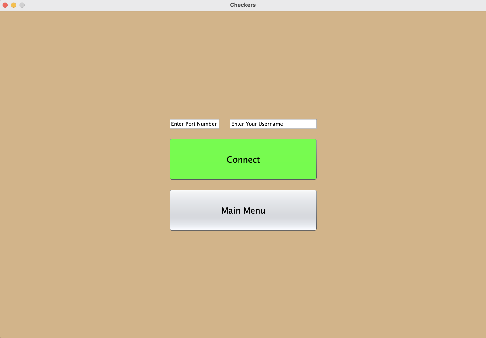
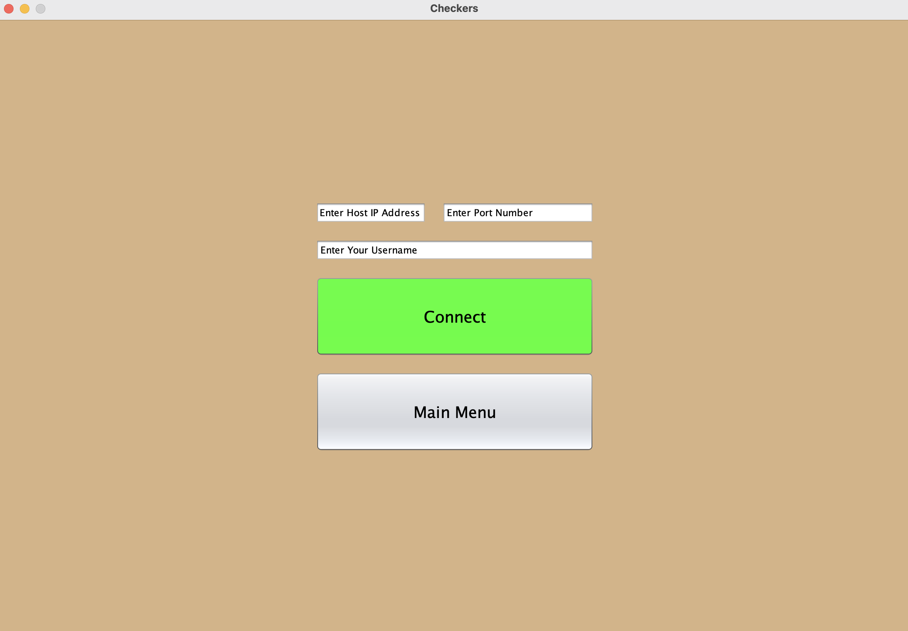
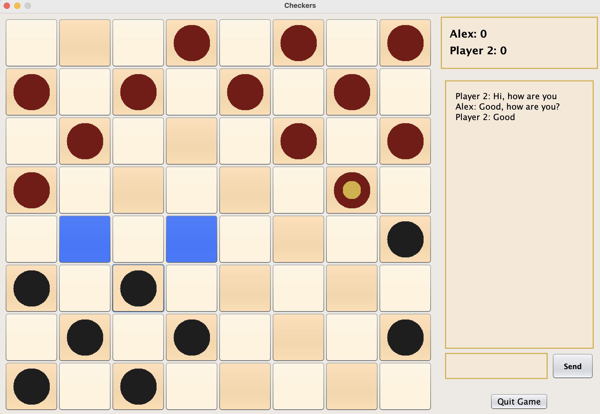
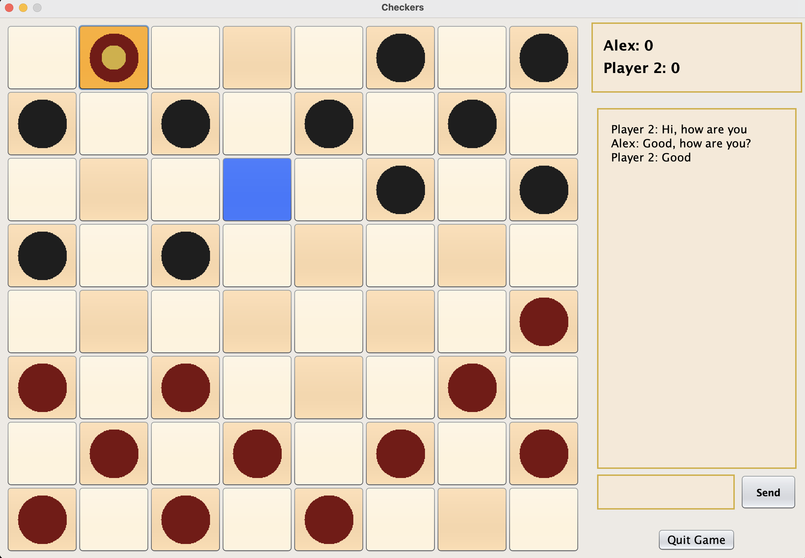
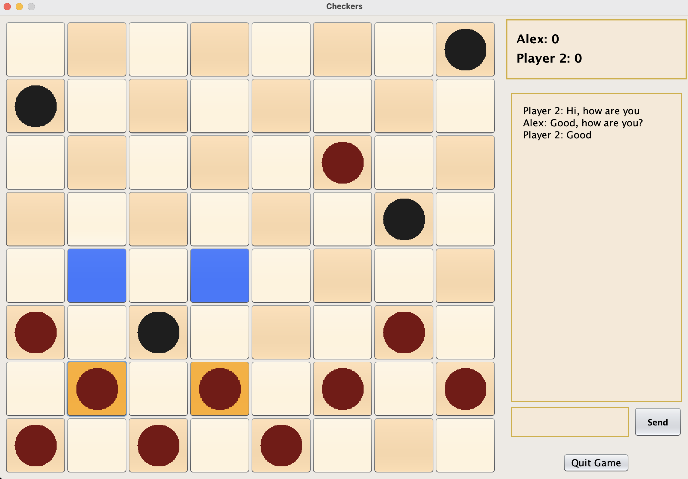
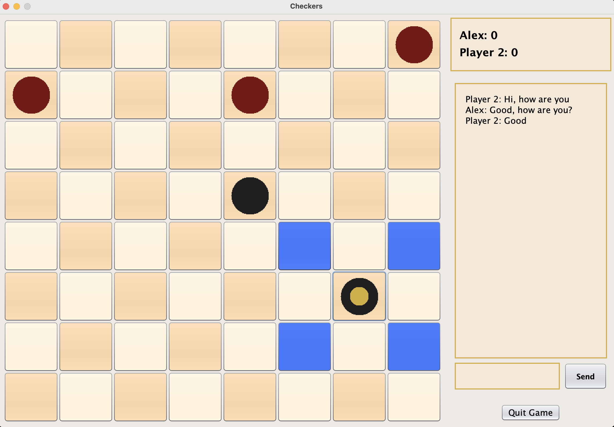
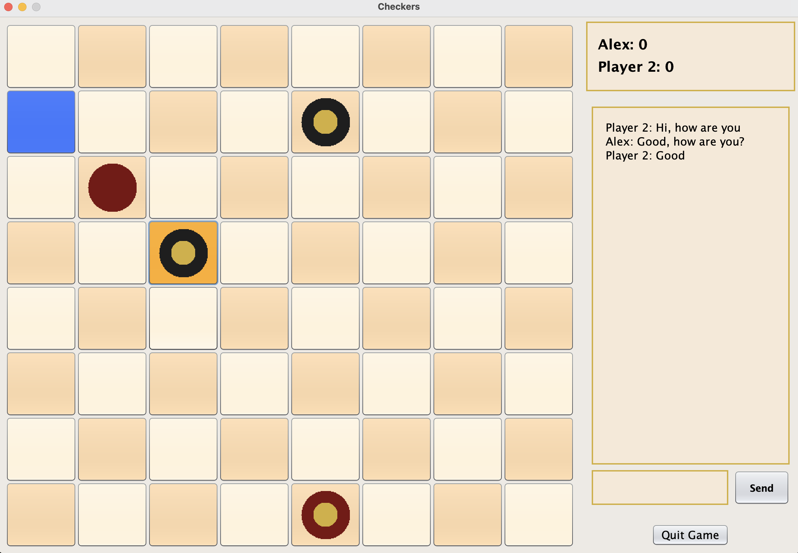
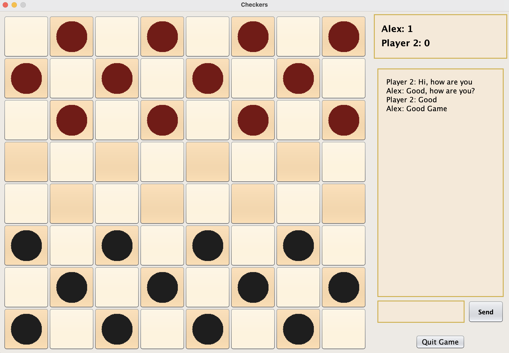
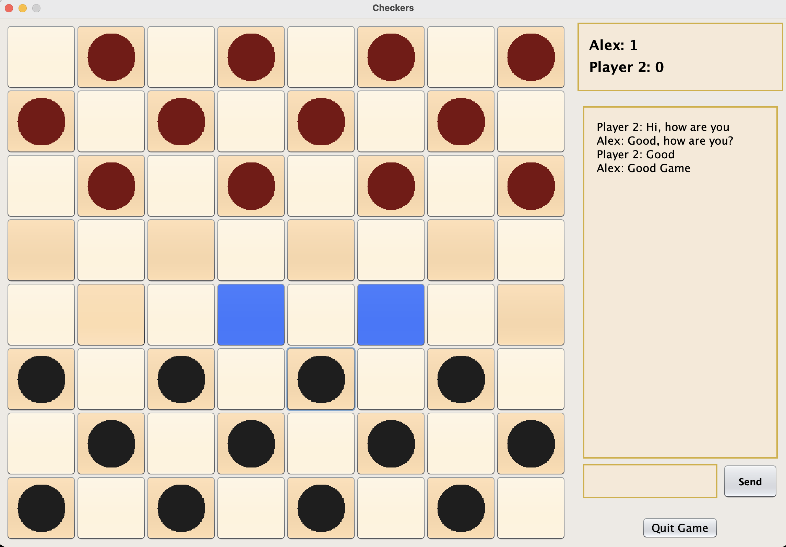
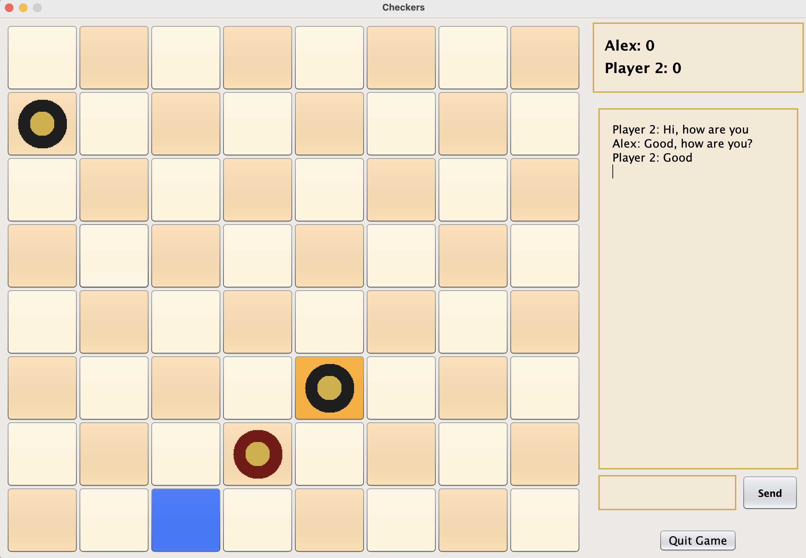

[](LICENSE)

# Checkers-Networking-Java
Two-player LAN checkers in Java Swing using TCP sockets; MVC architecture, Gradle build, runnable JAR.


# Features
- Two players over local network (host + client)
- Chat panel, scoreboard, jump/multi-jump rules
- MVC separation (model / view / controller)
- Gradle build + wrapper; runs on Java 21


# 🚀 Quick Start
## Prereqs
- Java 21 (recommended). Easiest via SDKMAN:
```bash
curl -s "https://get.sdkman.io" | bash
source "$HOME/.sdkman/bin/sdkman-init.sh"
sdk install java 21.0.4-tem
sdk use java 21.0.4-tem
java -version
```
- No need to install Gradle—wrapper included.


# Run (Gradle) with specific look
```bash
# Nimbus
JAVA_TOOL_OPTIONS="-Dswing.defaultlaf=javax.swing.plaf.nimbus.NimbusLookAndFeel" ./gradlew run
# Metal
JAVA_TOOL_OPTIONS="-Dswing.defaultlaf=javax.swing.plaf.metal.MetalLookAndFeel"  ./gradlew run
```

# Package & Run the JAR
```bash
./gradlew jar
java -jar build/libs/<your-jar>.jar
# Nimbus + IPv4 preference:
java -Djava.net.preferIPv4Stack=true \
     -Dswing.defaultlaf=javax.swing.plaf.nimbus.NimbusLookAndFeel \
     -jar build/libs/<your-jar>.jar
```


# 🕹️ How to Play (Host & Client)
Same machine (easiest)
1. Start the app twice (two terminals or run, then run again).
2. Window A → Host A Game. Port: 30000. (After clicking Host A Game in Window A, user of Window B must click Enter A Game in 10 seconds or less, or there is a timeout)
3. Window B → Enter A Game. IP: 127.0.0.1, Port: 30000.
Two machines on the same Wi-Fi
1. On the host Mac, find the IPv4:
```bash
ipconfig getifaddr en0   # Wi-Fi
```
2. Host uses Host A Game with a port (e.g., 30000).
3. Client uses Enter A Game → host’s IP (e.g., 10.0.0.113) + same port.
4. If prompted by macOS, allow incoming connections for Java
Tips:
- Ports accepted: 30000–40000
- Prefer IPv4 if needed: add -Djava.net.preferIPv4Stack=true when launching.
```bash
# Direct java (classes)
java -Djava.net.preferIPv4Stack=true \
     -Dswing.defaultlaf=javax.swing.plaf.nimbus.NimbusLookAndFeel \
     -cp build/classes/java/main checkers.SwingFrame

# Gradle (Nimbus)
JAVA_TOOL_OPTIONS="-Djava.net.preferIPv4Stack=true -Dswing.defaultlaf=javax.swing.plaf.nimbus.NimbusLookAndFeel" ./gradlew run

# Gradle (Metal)
JAVA_TOOL_OPTIONS="-Djava.net.preferIPv4Stack=true -Dswing.defaultlaf=javax.swing.plaf.metal.MetalLookAndFeel" ./gradlew run
```


# Screenshots

| Host menu | Client menu |
|---|---|
| <br><sub>Host menu</sub> | <br><sub>Client menu</sub> |

| Blue tiles (legal moves) | Orange = must-move piece |
|---|---|
| <br><sub>Blue tiles show where player can move</sub> | <br><sub>Forced-move indicator</sub> |

| One of two pieces must move | King can move up or down |
|---|---|
| <br><sub>One of two pieces must be moved</sub> | <br><sub>King movement</sub> |

| Multiple kings | Score update |
|---|---|
| <br><sub>Multiple kings</sub> | <br><sub>Score update</sub> |

| Score 1–0 (highlighted moves) | Game about to end |
|---|---|
| <br><sub>Score 1–0, legal moves highlighted</sub> | <br><sub>Game about to end</sub> |


# Project Structure
```
.
├── build.gradle.kts
├── settings.gradle.kts
├── gradlew / gradlew.bat / gradle/
├── README.md
└── src/main/java/checkers/
    ├── SwingFrame.java        # entry point
    ├── MainMenu.java          # menu -> host / enter
    ├── HostMenu.java          # host setup (port, name)
    ├── ClientMenu.java        # client join (ip, port, name)
    ├── HostGame.java          # host-side game panel + socket loop
    ├── ClientGame.java        # client-side game panel + socket loop
    ├── GameModel.java         # rules/state, networking protocol
    ├── GameView.java          # 8x8 board + highlights
    ├── GameTile.java          # one board square (renders pieces)
    ├── Piece.java             # piece model
    ├── ScoreBoard.java        # names + scores
    ├── ChatView.java          # chat UI
    └── GameModelSubscriber.java
```

# Troubleshooting
- Address already in use: Port still bound. Pick a different port or close the old process:
```bash
lsof -iTCP:30000 -sTCP:LISTEN
kill -9 <pid>
```
- **Connection refused:** host not running, wrong port, or mismatch.
- **No route to host:** wrong IP / not same LAN / firewall. Use host’s IPv4.

# Project history
- **2023:** Initial version built as a two-player LAN checkers game in Java Swing.
- **2025:** Migrated to this repo for ongoing maintenance and easier setup.
  - Switched to Gradle + wrapper, Java 21 toolchain.
  - Added clearer README and run instructions (JAR + Look & Feel flags).
  - Improved in-code documentation/Javadoc and minor UI fixes.

> Note: Commit history before 2025 is not preserved here. If needed, the previous repo is: [old repo link](https://github.com/Alex-Gorman/Checkers-Networking/tree/ChatWithGame).

**Credits:**
- **Alex Gorman** - game mechanics, socket protocol, move sync, scoring; Gradle/Java 21 migration; documentation.
- **[Yi Luan](https://github.com/LuanGIH)** — initial socket setup, chat.